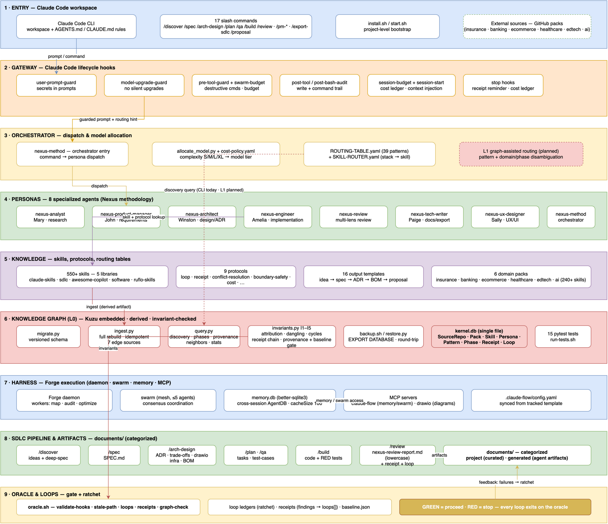
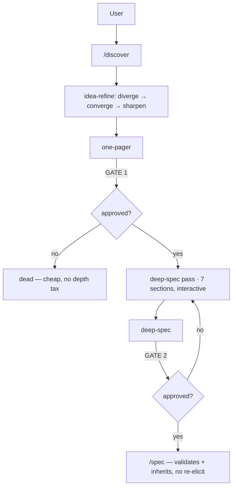
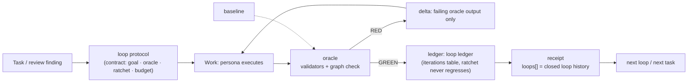
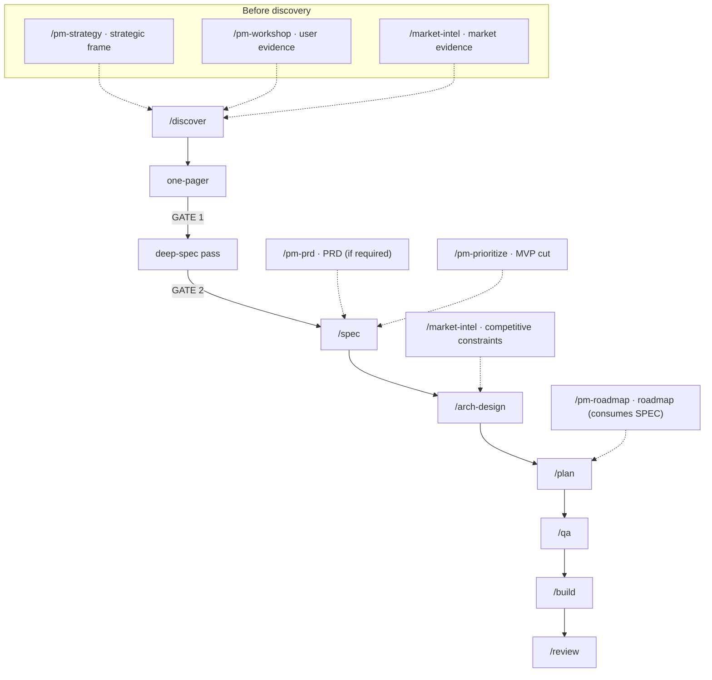

# SDLC Harness Engineering

Single-kernel agent system: **execution harness** (memory, swarms, MCP, daemon) + **methodology layer** (8 expert personas, 9 protocols, 22 technology stacks, 550+ skills) + a **stage-gated pipeline** for requirement discovery → deep spec → architecture → planning → QA test cases → build → review, plus **lateral product-workflow commands** (`/pm-strategy`, `/pm-prd`, `/pm-roadmap`, `/pm-prioritize`, `/market-intel`, `/pm-decisions`, `/pm-workshop`) and a **proposal generator** that assembles the full engagement trail into one self-contained document.

> ⚠️ **Showcase.** This repository presents the system and its deliverables. The underlying engine — its knowledge base, routing intelligence, and internal implementation — is our proprietary core and is not included here. To see the real system run, **contact the author**.

```
Agent = Model + Harness
  Harness executes (memory, parallel swarms, MCP tools, daemon)
  Methodology decides (personas, protocols, SDLC pipeline)
```

---

## Table of Contents

1. [Architecture](#architecture)
2. [Spec-Driven Development](#spec-driven-development)
3. [Deep-Spec Methodology](#deep-spec-methodology)
4. [Harness Loop Graph](#harness-loop-graph)
5. [Daily Work Guide](#daily-work-guide)
6. [Client Capacity Proposals (SLO → Config → BOM)](#client-capacity-proposals-slo--config--bom)
7. [Comprehensive Software Project Proposal](#comprehensive-software-project-proposal)
8. [Technology Stack](#technology-stack)
9. [Setup & Installation](#setup--installation)
10. [Commands](#commands)
11. [Skill Detection](#skill-detection--yes-the-agent-detects-needed-skills-per-task)
12. [Forge Harness — Start & Use](#forge-harness--start--use)
13. [Cost Management](#cost-management)
14. [Project Structure](#project-structure)
15. [Capability Skills](#capability-skills)
16. [Showcase Deliverables](#showcase-deliverables)
17. [Contact](#contact)

---

## Architecture

The current architecture snapshot — the nine layers from entry to oracle, and how a request flows through them:



### Layer Model

| # | Layer | Components | Responsibility |
|---|-------|-----------|----------------|
| 1 | **Entry** | Claude Code CLI · 16 slash commands · install/start scripts · project rules | the workspace; rules + command surface |
| 2 | **Gateway** | lifecycle guards — secret detection at the prompt boundary · model-upgrade guard · destructive-command guard + budget · post-tool audit · session budget/start · stop hooks | every prompt, tool call, and stop event passes a guard; no silent model upgrades |
| 3 | **Orchestrator** | dispatch of tasks to personas · complexity-based model allocation (S/M/L/XL → execution tier) · routing rules (39 patterns) + skill router (stack → skill) | decides **who** works, **with which skill**, **at what cost** |
| 4 | **Personas** | 8 agents — Mary (analyst) · John (PM) · Winston (architect) · Amelia (engineer) · reviewer · Paige (writer) · Sally (UX) · method (orchestrator) | bounded, specialized execution |
| 5 | **Knowledge** | 550+ skills (5 libraries) · 9 protocols · 16 templates · 6 domain packs (240+ business-AI skills) | what the kernel knows and how it behaves |
| 6 | **Knowledge Graph (L0)** | embedded graph store — derived, idempotent ingestion · query · invariant checks (I1–I5 + baseline gate) · backup/restore (round-trip) · 15 tests | machine-checkable provenance, routing, domain/phase coverage, receipt chains |
| 7 | **Forge Harness** | daemon (map/audit/optimize workers) · swarm (mesh ≤5) · persistent memory · MCP (diagram tooling) | cross-session memory, parallel execution, diagram tooling |
| 8 | **Pipeline & Artifacts** | `/discover → /spec → /arch-design → /plan → /qa → /build → /review` · categorized project documents | spec-driven artifact trail, each stage gated on approval |
| 9 | **Oracle & Loops** | validation oracle (validators + graph check) · loop ledgers (ratchet) · receipts · baseline | **GREEN = proceed, RED = stop** — every loop exits on the oracle |

### Data Flow

```
User request
  → Gateway guards (pass; context injected)
  → Command dispatch (slash command → persona)
  → Model allocation (complexity → tier, per cost policy)
  → Persona first action (loads protocols + kernel skill)
  → Skill routing (pattern rules + stack maps + domain/phase lookup via the knowledge graph)
  → Pipeline: /discover → /spec → /arch-design → /plan → /qa → /build → /review
  → Artifacts: idea briefs → deep-specs → SPEC → ADRs + trade-offs + diagrams + infra + BOM → tasks → test cases → code + tests → review report
  → Receipt written · findings loop back via loop protocol
  → Oracle gates every loop (GREEN/RED)
```

### Pipeline Flow — stages, gates, artifacts

Every stage gates on user approval before its artifact flows downstream. No artifact passes a gate unapproved; no stage starts before its gate is met.

```mermaid
graph LR
    A["/discover"] --> B["one-pager"]
    B -->|"GATE 1: approved"| C["deep-spec pass · 7 sections"]
    C --> D["deep-spec"]
    D -->|"GATE 2: approved"| E["/spec"]
    E --> F["SPEC · stories, ACs, roadmap M1…Mn"]
    F --> G["/arch-design"]
    G --> H["ADRs + trade-offs + diagrams + infrastructure + BOM"]
    H --> I["/plan"]
    I --> J["task plan + todo list"]
    J --> K["/qa"]
    K --> L["test cases"]
    L --> M["/build"]
    M --> N["code + tests"]
    N --> O["/review"]
    O -->|"findings loop back"| I
```



| Stage | Command | Persona | Inputs | Key activity | Gate | Outputs → consumed by |
|-------|---------|---------|--------|--------------|------|------------------------|
| Discovery | `/discover` | Mary (analyst) | raw idea | idea-refine (diverge → converge → sharpen), spec-first framing | **G1:** one-pager approved | idea brief → deep-spec, `/spec` |
| Deep-spec | inside `/discover` | Mary + deep-spec skill | approved one-pager | interactive problem-space elicitation — flows, edges, error matrix, NFRs, AC seeds, boundaries, open questions; `[ASSUMPTION]` tagging | **G2:** deep-spec approved | deep-spec → `/spec` (inherits), `/arch-design` (open questions) |
| Specification | `/spec` | John (product manager) | idea doc + deep-spec | TDD-style stories (each AC testable, RED test named), boundaries, **Roadmap & Timeline (M1…Mn)** | user approval | SPEC → `/arch-design`, `/plan`, `/qa` |
| Architecture | `/arch-design` | Winston (architect) | SPEC (direct entry OK) | ADRs, trade-off ledger (TO-N ↔ ADR), C4 + component + sequence diagrams, API contracts, boundary-safety check, **infrastructure + cost design** (MVP/Production topologies, RTO/RPO, named budget ceiling, monthly run-rates), deployment diagram with **provider icons** (AWS/Azure/GCP/K8s) | user approval | ADRs · trade-offs · architecture docs (+ diagrams with provider icons) · infrastructure · costs → `/plan`, `/qa`, `/build` |
| Planning | `/plan` | PM / analyst | SPEC + architecture + trade-offs | dependency graph, vertical slices, checkpoints, risk ordering | user approval | task plan, todo list → `/qa`, `/build` |
| QA test cases | `/qa` | QA engineer | tasks + SPEC | per-AC test cases (Given/When/Then), coverage map, fixtures, risk-based ordering | user approval | test cases → `/build` (RED tests) |
| Build | `/build` | Amelia (engineer) | tasks + test cases | TDD RED → GREEN → REFACTOR per task; per-task commits | tests green per task | code + tests, test summary → `/review` |
| Review | `/review` | reviewer | code + artifacts | 4-lens review — Quality, Security, Architecture, Dependency | 0 Critical findings | review report; findings loop into `/plan` (loop protocol) |

### Persona Map — who executes each stage

| Persona | Name | Role | Command(s) |
|---------|------|------|------------|
| `nexus-method` | — | **Orchestrator** — routes work through the kernel, loads protocols, dispatches personas | all (entry point) |
| `nexus-analyst` | Mary | Business analyst — discovery, deep-spec elicitation, market intel | `/discover` · `/market-intel` · `/plan` |
| `nexus-product-manager` | John | Product manager — stories, ACs, roadmap | `/spec` · `/pm-strategy` · `/pm-prd` · `/pm-roadmap` · `/pm-prioritize` · `/pm-decisions` · `/pm-workshop` |
| `nexus-architect` | Winston | Solution architect — ADRs, trade-offs, diagrams, **infrastructure + cost design** | `/arch-design` |
| `nexus-engineer` | Amelia | Software engineer — TDD implementation (RED → GREEN → REFACTOR), per-task commits, stack-skill routing | `/build` · `/build auto` |
| nexus-qa | QA engineer | Test cases — per-AC RED tests, coverage map | `/qa` |
| `nexus-review` | Reviewer | Multi-lens review — quality, security, architecture, dependency + receipt | `/review` |
| `nexus-tech-writer` | Paige | Technical writer — proposal / SDLC export | proposal command |
| `nexus-ux-designer` | Sally | UX designer — interface planning, design systems | lateral (frontend-design, workshop companions) |

**Execution rule:** tech-stack keywords (spring-boot, react, nextjs, aws, azure, gitlab, …) are detected automatically → the matching **stack skill AND expert skill** both load under the stage's persona.

---

## Spec-Driven Development

The kernel is **spec-driven by construction**: every artifact is written **before** the code that implements it, and every artifact has a defined consumer.

```
idea → deep-spec → SPEC → ADR/trade-offs → tasks → test cases → code → review
  ↑        ↑           ↑          ↑            ↑         ↑        ↑
(problem)(assumptions)(stories+ACs)(decisions) (plan)    (RED tests)(gate)
```

Non-negotiables:

- **A test case per acceptance criterion** — `/qa` produces the test cases; `/build` derives RED tests from them; no AC ships untested.
- **Gates on user approval** — no artifact passes a stage without explicit approval (GATE 1: one-pager, GATE 2: deep-spec, then per-stage approval).
- **Decisions are recorded, not remembered** — every load-bearing choice gets an ADR + a TO-N row in the trade-off document; deferred decisions carry revisit conditions.
- **`[ASSUMPTION]` tagging** — anything unverified is tagged, tracked in the assumptions log, and validated at its gate.
- **Direct entry allowed** — `/arch-design` from a conversation, `/qa` straight after `/plan`; the pipeline gates stay intact either way.

---

## Deep-Spec Methodology

**Deep-spec is discovery's depth layer.** After the `/discover` one-pager is approved (gate 1), the analyst runs an interactive elicitation pass that mines **problem-space depth** from the idea owner — everything `/spec` and `/qa` would otherwise have to re-ask — into the deep-spec (gate 2). `/spec` then validates and inherits it; it never re-elicts.

*Design: deep-spec discovery design doc (C4 diagrams, doc-schema contract, change set) · ADR-0001…0005 · trade-off ledger · QA test cases*

### Discovery flow — two gates



### The seven sections

| # | Section | What it captures |
|---|---------|------------------|
| 1 | User flows & journeys | Actors, happy path, variants, entry/exit points |
| 2 | Edge cases | Empty, max, duplicate, concurrent, missing, partial |
| 3 | Error matrix | Failure → expected behavior, severity (tolerable / critical) |
| 4 | Non-functional requirements | Performance, security, scale, availability — what must *hold* |
| 5 | Acceptance-criteria seeds | Testable "done" conditions — confirmed into final ACs by `/spec` |
| 6 | Boundaries | Always / ask-first / never |
| 7 | Open questions | Unresolved items with owners — incl. solution-space routing to `/arch-design` |

Each section is elicited with 3–5 questions and **validated by the user before the next**; every inference is tagged `[ASSUMPTION]` with a validation gate; a **fast mode** (draft-then-review) is available on explicit opt-in. **Depth boundary (ADR-0003):** the deep-spec covers problem space only — no data contracts, API contracts, tech stack, or project structure; those stay with `/arch-design`.

### Strengths

- **No re-elicit, no drift** — `/spec` reads the deep-spec (matching name) and inherits flows, edges, and AC seeds; the identity chain (ideas → deep-specs → SPEC) keeps every stage on the same source of truth.
- **Edges mined while the owner is in the room** — failure modes and error paths are pulled out conversationally at discovery, not discovered at QA three stages later.
- **Throwaway ideas stay cheap** — the depth pass runs only after gate 1 (one-pager approval), so half-formed ideas never pay the depth tax (ADR-0005).
- **Assumptions are shown, not silently made** — `[ASSUMPTION]` tagging with validation gates carries the architecture discipline's "shown, not silently made" principle into discovery.
- **No authority conflict** — the deep-spec is a *contributor* to the SPEC, never a co-owner; ADRs, specs, and test suites keep their sole owners.
- **Stronger, cheaper test suites** — `/qa` maps pre-mined edges and errors directly onto test levels instead of hunting for them; the kernel's own test cases verify the whole journey, including the full E2E: fixture idea → one-pager → deep-spec → SPEC inheritance.

---

## Harness Loop Graph

Every piece of work that needs iteration runs as a **ratcheted loop** — the rule is *no oracle, no loop*:



- **Oracle** = executable exit condition (kernel-level; full for pipeline work).
- **Ratchet** = a metric that must never regress vs. baseline (e.g. high-severity finding counts, graph invariant counts).
- **Exit** = converged | plateau | oscillation | budget — each recorded in the ledger; escalations name a target.
- Receipts with high findings **must** carry `loops[]`; the graph invariant I4 enforces this (receipt → loop chain).

---

## Daily Work Guide

Daily rhythm: install once into a project; every session starts the harness (daemon + memory + swarm + MCP — idempotent, safe to run anytime) with a graph check and oracle report; run the pipeline commands during the day; run the oracle before closing any loop; stop the daemon when done.

```
/discover /spec /arch-design /plan /qa /build /review     (slash commands)
oracle GREEN = proceed
```

---

## Client Capacity Proposals (SLO → Config → BOM)

A client-facing feature that converts quantified requirements into infrastructure configuration and cost — **AWS only, Azure only, AWS + Azure multi-cloud, with an optional GCP data plane**.

### How to execute

**Direct entry (fastest):** run `/arch-design` with a capacity prompt —

```
/arch-design produce a capacity proposal for {client/system}
  Requirements: availability 99.9%, latency p95 < 3s, 500 concurrent users,
  5M pages/mo OCR, RTO 1h / RPO 15min, ap-southeast-1
  Mode: AWS + Azure multi-cloud, GCP data plane (BigQuery)
```

The architect runs the capacity elicitation → computes the capacity math (Little's-law throughput, C/L per-instance model, availability N+1 tiers) → fills the proposal template → produces the infrastructure document, the cost BOM, and the deployment diagram.

**Full pipeline (formal engagements):** `/discover` (one-pager, gate 1) → deep-spec (gate 2) → `/spec` → `/arch-design` → `/review`. Each stage gates on user approval.

**Skill routing is automatic:** tech keywords (`aws`, `azure`, `gcp`, `bigquery`, `cloud sql`, …) fire high-priority routing rules — the cloud-architect and the cloud cost skills all load; no manual skill selection.

### What the agent produces

| Deliverable | Description |
|-------------|-------------|
| Client proposal (requirements → math → config → BOM → verification) | capacity proposal template filled for the client |
| Infrastructure architecture (MVP + Production, NFRs, CI/CD) | per-component infrastructure design |
| Cost BOM (per-mode, per-cloud) | per-component cost model |
| Deployment diagram (provider icons) | per-component deployment diagram |

### Deployment modes supported

| Mode | Stack | BOM |
|------|-------|-----|
| A — AWS only | EKS/ECS/EC2/Lambda · RDS · ElastiCache · MSK · S3 | AWS column |
| B — Azure only | AKS · Azure SQL · Cache for Redis · Event Hubs · Functions · Blob | Azure column |
| C — AWS + Azure | Entra ID identity + AWS workloads + Direct Connect/ExpressRoute | AWS + Azure + interconnect |
| + GCP data plane | BigQuery/GCS lakehouse (optional, any mode) | + GCP column |

Capacity is expressed in **capacity terms first** (vCPU/memory/connections/IOPS) and mapped per provider (`m6g.xlarge` ↔ `D4ds v4` ↔ `n2-standard-4`). The capacity proposal template is a workbook: inputs → formulas → config → BOM → SLI verification, with a worked example.

---

## Comprehensive Software Project Proposal

> **Status: delivered end-to-end ✅**

A client-facing deliverable assembled from **all 16 output templates** into one proposal — requirements & NFRs (SLI/SLO) → solution (C4 · component · microservices) → architecture decisions → security → infrastructure/capacity/scaling → cost BOM → delivery plan → quality → risks — exported to HTML/MD/PDF.

**Live sample:** [Clinic Portal — full proposal](documents/generated/proposals/Clinic-portal-proposal.html) — the complete client proposal as one self-contained page: requirements → architecture → infrastructure → cost model → delivery plan.

### How to run

```
/proposal AcmeCorp --format html --out AcmeCorp-proposal.html
```

The technical writer reads the artifact trail, assembles the 10 sections per the proposal template, and renders a self-contained HTML in a design language built for clients (cover with deployment mode + commitments, sidebar TOC, ledger tables with totals, severity badges, print stylesheet). Missing artifacts render as **"To be confirmed"** — never invented.

### Section map (16 templates → 10 sections)

| Proposal section | Source templates |
|------------------|------------------|
| Cover + Exec summary | synthesized |
| §1 Requirements & NFRs (SLI/SLO) | idea · deep-spec · spec · success-metrics · opportunity-assessment |
| §2 Solution Overview (C4 · component · microservices) | design-doc + C4/component diagrams |
| §3 Architecture & Decisions (+SLO→arch) | adr · trade-off · design-doc (API) |
| §4 Security (first-class) | design-doc security + capacity security rows |
| §5 Infrastructure, Capacity & Scaling | infrastructure · capacity-proposal |
| §6 Cost / BOM (per-mode, per-cloud) | bom + capacity BOM |
| §7 Delivery Plan | spec roadmap · plan graph |
| §8 Quality & Testing (SLI verification) | QA test cases · review |
| §9 Risks & Assumptions | risk-register · assumptions-log · decision-log |
| §10 Appendix | THIRD-PARTY-NOTICES · glossary · receipts |

Formats: `--format html` (default, self-contained, print-ready) · `md` · `pdf`. Deployment modes: A (AWS) · B (Azure) · C (AWS+Azure) · + GCP data plane.

### Coverage contract (client-required, verified at build)

| Requirement | Proposal section | Status |
|-------------|------------------|--------|
| Component diagram | §2 Solution Overview | ✔ |
| C4 model (context + container) | §2 Solution Overview | ✔ |
| Microservices architecture | §2 (boundaries, communication, data ownership) | ✔ |
| Scaling | §5 (autoscaling bounds, horizontal/vertical, peak) | ✔ |
| **Security** | **§4 — first-class section** (zero-trust, identity, encryption, compliance) | ✔ |
| **Infrastructure** | **§5 — first-class** (topologies, NFRs, CI/CD, modes) | ✔ |
| NFRs (SLI/SLO) | §1 + §3 SLO→architecture mapping + §8 verification | ✔ |

---

## Technology Stack

| Layer | Technology | Purpose |
|-------|-----------|---------|
| **Platform** | Claude Code (CLI) | Host runtime — tools, filesystem, permissions |
| **Harness** | Forge (daemon, memory, swarm, MCP) | Execution: memory, parallelism, orchestration |
| **Methodology** | Nexus SDLC workflow kernel | Canonical SDLC workflow |
| **Skills** | 5 skill libraries — domain experts, SDLC process, dev skills, software references | Domain expertise, process workflows, references |
| **Stacks** | 22 technology stacks (direct copies) | nestjs, spring-boot, golang, dot-net, java, python, react, nextjs, vue, nuxt, ui-ux, flutter, swift-ui, android, kotlin-compose, react-native, aws, azure, langchain, mlflow, ml-agents, context-engineering |
| **State** | persistent memory database | Cross-session memory |
| **Config** | routing + governance rules (pattern tables, catalogs, authority map, cost tiers) | Routing, catalogs, authority, cost |
| **Scripts** | Bash + Ruby | Install, start, validate, sync |
| **Output** | Markdown + Draw.io | SPEC, ADRs, trade-off docs, architecture diagrams, QA test cases, review reports |

### Development Languages Supported (via stacks)

| Category | Stacks |
|----------|--------|
| **Backend** | NestJS, Spring Boot, Java, Golang, .NET, Python |
| **Frontend** | React, Next.js, Vue, Nuxt, UI/UX |
| **Mobile** | Flutter, Swift UI, Android, Kotlin Compose, React Native |
| **Cloud** | AWS, Azure |
| **AI/ML** | LangChain, MLflow, ML Agents, Context Engineering |

---

## Setup & Installation

### Prerequisites

- **Claude Code** v2.1.220+
- **Node.js** v20.12+
- **Python** 3.10+
- **Ruby** (macOS built-in)

### Option A: Install into a new project

Everything lands in the project's configuration directory (project-level wrapper; symlink = single source of truth, or copy mode for a self-contained install). Then start Claude Code in the project and start the harness — the pipeline commands are ready.

### Option B: Load without installing (session-only)

Load the kernel directly in a session without installing into the project.

### Option C: Marketplace install

Install as a marketplace plugin (requires your own plugin hosting).

### What you get

```
your-project/
├── CLAUDE.md           ← project rules
├── commands/           ← 16 slash commands (auto-discovered — 8 pipeline + 8 lateral)
├── agents/             ← 8 expert personas (auto-discovered)
├── skills/             ← skill libraries (general + domain + stack)
├── hooks/              ← lifecycle guards
├── stacks/             ← 22 technology stacks
├── protocols/          ← behavioral protocols
└── documents/          ← project artifacts (ideas, specs, designs, costs, reports)
```

---

## Commands

| Command | Persona | Purpose | Key SDLC Skills | Produces |
|---------|---------|---------|-----------------|----------|
| `/discover` 🧠 | Mary (analyst) | **Idea → concept.** Refines raw ideas; surfaces assumptions; spec-frames output; mines problem-space depth for approved ideas. | idea-refine, spec-driven-development, deep-spec | idea brief + deep-spec (approved ideas) |
| `/spec` 📋 | John (product manager) | **Concept → contract.** TDD-style user stories — each AC testable, each story names its RED test. | spec-driven-development, test-driven-development | SPEC (objectives, stories, ACs, roadmap & timeline M1…Mn) |
| `/arch-design` 🏛 | Winston (architect) | **Contract → design.** ADRs, trade-off document, API contracts, data models, diagrams, **infrastructure + cost** (budget ceiling, run-rates), deployment diagram with **provider icons**. Direct entry supported. | api-and-interface-design, nexus-architecture, cloud-architect, cost-optimization, diagram generator | ADRs · trade-offs · architecture docs · diagrams (provider icons) · infrastructure · costs |
| proposal 📤 | Paige (tech writer) | **Artifacts → one-page proposal.** Renders the full trail (discovery → deployment) into a single self-contained HTML — sidebar TOC, status badges, ledger tables, print-ready. | code-documenter, diagram generator (design language) | one-page proposal HTML |
| `/plan` 📊 | Mary / John | **Design → tasks.** Dependency-ordered, vertically-sliced tasks. | planning-and-task-breakdown, epics-and-stories | task plan + todo list |
| `/qa` 🧪 | QA engineer | **Tasks → test cases.** Per-story unit/API/E2E test cases from acceptance criteria. | e2e-test generation, test-master, test-driven-development, browser testing | test cases (coverage map) |
| `/build` 🛠 | Amelia (engineer) | **Tasks → code.** TDD (RED→GREEN→REFACTOR) — RED tests derived from QA test cases. `auto` = full plan in one pass. | test-driven-development, build skills, e2e-test generation | Code + tests (traceable to test cases), E2E automation summary, per-task commits |
| `/review` 🔍 | reviewer | **Code → verdict.** 4-lens review (Quality, Security, Architecture, Dependency). | security-and-hardening, review skills | review report |

### Lateral Product-Workflow Commands (supporters — the pipeline remains the kernel)

On-demand product workflows. They run under a persona, produce their own artifacts, and **feed** the pipeline (`/pm-prd` → `/spec`, `/market-intel` → `/discover`, `/pm-roadmap` ← consumes the SPEC) without becoming pipeline stages or gates. **The pipeline never requires them** — they are accelerators for when the artifact type matters.

| Command | Persona | Purpose | Produces |
|---------|---------|---------|----------|
| `/pm-strategy` 🎯 | John (product manager) | Positioning → opportunity → roadmap direction | strategy brief → `/pm-prd`, `/spec` |
| `/pm-prd` 📄 | John (product manager) | Full PRD with Gherkin ACs — feeds `/spec` | PRD → `/spec` |
| `/pm-roadmap` 🗺 | John (product manager) | Strategic roadmap + epic breakdown — consumes the SPEC | roadmap → `/plan` |
| `/pm-prioritize` ⚖️ | John (product manager) | Evidence-based backlog ranking | ranked decision → `/spec` |
| `/market-intel` 🕵️ | Mary (analyst) | Cited market/competitive intel pack | intel pack → `/discover`, `/arch-design` |
| `/pm-decisions` 💰 | John (product manager) | SaaS health/growth/pricing verdicts | decisions brief |
| `/pm-workshop` 🛠 | Sally (UX) + Mary | Facilitated discovery workshops | workshop artifacts → `/discover` |

**`/pm-strategy` — "Where are we going?"** builds the strategic frame — positioning, the locked problem, opportunity options, and sequenced roadmap direction — before any product decisions are made. *Use when:* starting a new product line; the team disagrees on direction; a quarterly strategy review. It becomes context for `/pm-prd` and `/spec` — it is *not* a gate.

**`/pm-prd` — "The product contract"** produces a full 10-section PRD — executive summary, problem, personas, strategic context, solution, success metrics, user stories with Gherkin ACs, out-of-scope, dependencies/risks, open questions — with assumptions 🔶 and open questions 🔵 tagged, never silently filled. The PRD feeds `/spec`, which **validates and inherits** it (no re-elicit).

**`/pm-roadmap` — "What ships when, and why that order"** builds the strategic roadmap — priorities, epic definitions, stakeholder alignment, dependency-sequenced milestones — grounded in the customer journey. It consumes the SPEC (never re-asks what `/spec` already answered) and feeds `/plan`.

**`/pm-prioritize` — "What's in the MVP, what waits"** ranks the backlog with evidence — deliberately selecting the prioritization framework (RICE / ICE / Kano / alternative) by stage and team context, scoring every candidate, and recording rejected items with reasons. Often run *during* `/spec` when scope is contested.

**`/market-intel` — "What's the evidence on the market and competitors?"** produces cited market/competitive intelligence — landscape scan, competitive snapshot, ongoing watch, and field-ready battle cards where every claim carries a source URL, date, and Fact/Inference/Assumption label. Run once for a snapshot, or set up the watch for ongoing deltas.

**`/pm-decisions` — "The numbers say what?"** delivers SaaS health, growth, and pricing verdicts from quantified metrics — every conclusion traces to a listed metric or is labeled an assumption; missing metrics are listed, never invented.

**`/pm-workshop` — "Let's think together, structured"** runs facilitated discovery workshops — journey mapping, story mapping, lean UX canvas, JTBD — one question per turn with tracked progress, producing structured artifacts plus the decisions and assumptions made during the session.

#### Incorporating lateral commands into the pipeline

The pipeline gates (G1 one-pager, G2 deep-spec) never move; lateral commands slot *beside* stages as optional accelerators:



| Where in the flow | Lateral command | What it adds |
|-------------------|-----------------|--------------|
| Before `/discover` | `/pm-strategy` · `/pm-workshop` · `/market-intel` | Strategic frame, user evidence, market evidence → better one-pager, fewer discovery round-trips |
| Before `/spec` | `/pm-prd` · `/pm-prioritize` | PRD contract to validate-and-inherit; evidence-based MVP cut |
| Between `/spec` and `/arch-design` | `/market-intel` | Competitive constraints for architecture decisions |
| After `/spec`, before `/plan` | `/pm-roadmap` | Epic-level roadmap the plan slices from |
| Anywhere (ad hoc) | `/pm-decisions` | SaaS health/growth/pricing verdicts feeding prioritization |

**The rules of incorporation:**
1. **Optional, never required** — the pipeline runs end-to-end without any lateral command; they exist to produce artifact types the pipeline doesn't.
2. **Feed, never gate** — lateral artifacts feed stages (validate-and-inherit) or inform decisions; they never become gates or stages themselves.
3. **No re-elicit** — when a lateral command consumes pipeline output (e.g., `/pm-roadmap` reading the SPEC), it validates and inherits rather than re-asking.
4. **Artifacts pass by name** — strategy, PRD, intel, roadmap, decisions, workshops; no in-memory handoffs.

### Quick Start

```
/discover "Build a multi-tenant appointment scheduler"   # 1. Idea + deep-spec (risk, assumptions, flows, edges, NFRs)
/spec                                                    # 2. Contract
/arch-design                                             # 3. Design (ADRs + trade-off doc)
/plan                                                    # 4. Tasks
/qa                                                      # 5. Test cases per story/task
/build auto                                              # 6. Build all (RED tests from test cases)
/review                                                  # 7. Verdict
```

**Example combined flow (pipeline + lateral commands):**

```
/market-intel "multi-tenant scheduling SaaS"   # evidence before discovery (opportunity case)
/pm-workshop "scheduler onboarding journey"    # user evidence
/discover "Build a multi-tenant appointment scheduler"
/pm-strategy "appointment scheduler line"      # strategic frame (optional)
/pm-prioritize "availability sync, smart routing, billing, analytics"   # MVP cut
/spec                                          # inherits one-pager + deep-spec + PRD/ranking context
/pm-roadmap                                    # roadmap from SPEC → /plan slices
/arch-design
/plan
/qa
/build auto
/review
```

---

## Skill Detection — Yes, the agent detects needed skills per task

When a task arrives, the orchestrator reads its keywords — action, domain, tech stack — and loads **only the skills that task needs**. No manual skill selection, ever.

- *"Fix a typo"* → loads just the review skill context (~300 words, not thousands)
- *"Build a Flutter screen"* → routes to the engineer persona + Flutter stack skills
- *"Architecture for an AWS system"* → routes to the architect persona + cloud and cost skills

Detection is **progressive**: the orchestrator first routes the task to the right persona, then loads the skills for the task's stack and domain on demand. Tech-stack keywords (flutter, react, aws, azure, python, …) fire high-priority rules and load both the stack skill and its expert counterpart.

**Example trace:** *"Build a Flutter payment screen with Stripe"* → engineer persona → Flutter stack skills → Stripe payment skill. One task, three targeted loads — nothing more.

---

## Forge Harness — Start & Use

### Start & Use

First push of the project repository:

```
git push --set-upstream origin main
```

### Cross-session memory (the "I can't remember" fix)

```
memory store -k <key> -v "<value>"   # save a fact
memory get -k <key>                   # recall it in any session
```

---

## Cost Management

| Layer | Mechanism | Prevents |
|-------|-----------|----------|
| **Skill routing** | Load only task-relevant skills; stacks per mode | Wasted context (~80–99% savings) |
| **MCP gating** | 4 cost tiers with daily budgets; concurrency cap per agent + total; soft budget (warn 80%, block 100%) | Unbounded paid API calls |
| **Model routing** | default workhorse model, cheap tier for simple tasks; premium tiers gated on complexity | Premium models on trivial tasks |
| **Hooks + receipts** | Pre-tool guard, post-tool audit, receipt protocol | Rework from incomplete work |

---

## Capability Skills

The harness carries a library of engineering capabilities it applies on your project — each one a bounded body of expertise with its own deliverables, standards, and test approach:

| Capability | What it brings |
|------------|----------------|
| [AI-Native Product Engineering](skills/ai-native-product-engineering/SKILL.md) | Designing and shipping LLM-powered products: prompt architecture, evaluation, cost & latency engineering, guardrails |
| [Fraud & Risk Systems](skills/fraud-risk-systems/SKILL.md) | Detection pipelines, risk scoring, compliance controls for high-stakes transactions |
| [E-commerce & Personalization](skills/ecommerce-personalization/SKILL.md) | Search, recommendations, catalog, checkout — engineered for conversion and scale |
| [Fintech & Payments](skills/fintech-payments/SKILL.md) | Payment orchestration, ledgering, reconciliation, financial security — where correctness is non-negotiable |
| [Data Platforms & Analytics](skills/data-platforms-analytics/SKILL.md) | Warehousing, pipelines, and analytics from raw sources to decision-ready data |
| [Mobile & Cross-Platform Development](skills/mobile-cross-platform/SKILL.md) | Native-quality iOS + Android from a single codebase, including release engineering |
| [Cloud Architecture & Migration](skills/cloud-architecture-migration/SKILL.md) | Moving and modernizing workloads on the cloud without the cost horror stories |
| [Security Hardening](skills/security-hardening/SKILL.md) | Defense in depth for applications, infrastructure, and the delivery process itself |

---

## Showcase Deliverables

Real artifacts from real engagements, kept as portfolio samples:

| Deliverable | What it shows |
|-------------|---------------|
| [Clinic Portal — 1-page proposal](documents/generated/proposals/Clinic-portal-proposal.html) | The complete client proposal as **one page**: requirements → architecture → infrastructure → cost model → delivery plan, self-contained and print-ready |
| [Zero-Trust Architecture](documents/generated/architecture/architect.drawio) | Zero-trust architecture for AWS/LLMOps: identity-driven access (Entra ID SSO · SAML · JWT/JWKS validation), encrypted private interconnect, segmented services (EKS OCR · RAG · Agent · Eval), external SaaS integrations (open in draw.io) |

### Smaller sample projects — the pipeline at mini-scale

Illustrative samples for demonstration, not client deliverables — the same stages, the same discipline, readable in minutes:

| Project | What it shows |
|---------|---------------|
| [Restaurant Loyalty App](demo-projects/restaurant-loyalty-app/README.md) | A small engagement run end to end — a double-tap on the points ledger surfaces as a critical test case |
| [Insurance Claims Assistant](demo-projects/insurance-claims-assistant/README.md) | An AI product where the hard engineering is the guardrails: human-in-the-loop requirements and adversarial tests |
| [E-commerce Search & Personalization](demo-projects/ecommerce-search-personalization/README.md) | Architecture-stage work catching a real cost problem (full re-index vs incremental) before any code exists |

### Rapid app showcases — 10-minute production builds

Proof of speed: two production-grade applications, each generated end to end in under 10 minutes. Screenshots show the apps running — no mockups.

| App | Stack | What it is | Screenshot |
|-----|-------|------------|------------|
| [SaaS Dashboard](demo-projects/nextjs-saas-dashboard/README.md) | Next.js | Production-grade admin dashboard: auth, data tables, charts, responsive layout | [view](demo-projects/nextjs-saas-dashboard/preview.png) |
| [Booking App](demo-projects/flutter-booking-app/README.md) | Flutter | Cross-platform booking & reservation app — one codebase, iOS + Android | [view](demo-projects/flutter-booking-app/preview.png) |

---

## Contact

**Want to see how this works on your project? Contact me directly — happy to walk you through a live demo or schedule a kickoff workshop.**

- 📧 **Email:** `duongphamthaibinh@gmail.com`
- 📞 **Phone / WhatsApp:** `+84 968009244`

---

*© 2026 — All rights reserved. This showcase repository contains sample deliverables and methodology descriptions only; the underlying technology is proprietary.*
