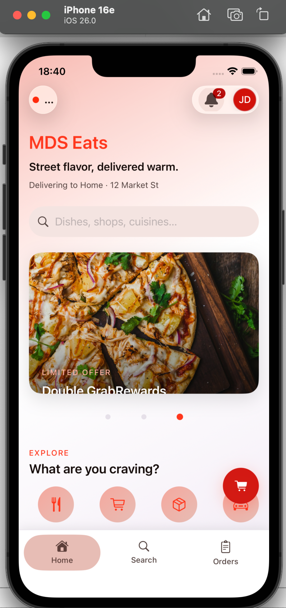

# Flutter Booking App — 10-Minute Showcase

> **Showcase build.** A demonstration application built to prove speed — a cross-platform booking app generated end to end by the agent harness in under 10 minutes. Not a client engagement.

## What it is

A cross-platform booking and reservation app on Flutter — the mobile pattern behind clinics, restaurants, salons, and seat reservations:

- Browse and search available slots
- Pick a time and confirm a booking
- See your upcoming reservations
- Clean, consistent UI on both iOS and Android from one codebase

## The proof

**One prompt. Under 10 minutes. Production grade.**

The screenshot below is of the app running — real screens, real flows, no mockups. The build covered the app architecture, the booking flows, and the UI in a single agent pass.

## What it says about the engagement model

Booking and reservation flows are a core pattern in the portfolio — the same discipline that produced this demo in minutes is applied at production scale to real engagements (staff roles, payments, ledger integrity, availability locking). The demo proves the harness does not need weeks to stand up a working mobile product.

See the full pipeline description in the [main README](../../README.md).
