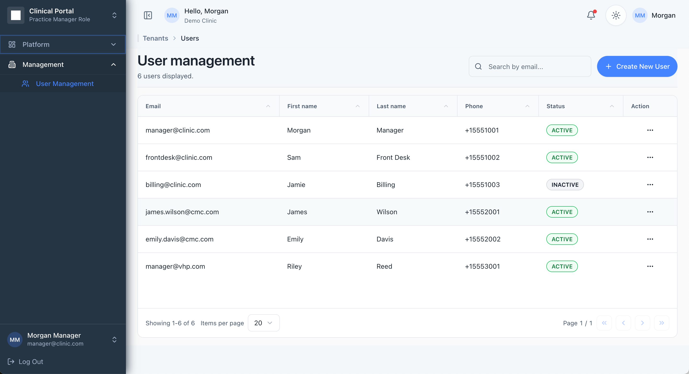

# Next.js SaaS Dashboard — 10-Minute Showcase

> **Showcase build.** A demonstration application built to prove speed — a production-grade SaaS dashboard generated end to end by the agent harness in under 10 minutes. Not a client engagement.

## What it is

A production-grade SaaS admin dashboard on Next.js — the kind of product shell most teams spend weeks scaffolding:

- Authentication and session handling
- Data tables with filtering and pagination
- Charts and key-metric cards
- Responsive layout that works from desktop to phone

## The proof

**One prompt. Under 10 minutes. Production grade.**

This is not a mockup or a static page — the screenshot below is of the running application. The build covered architecture, implementation, and quality in a single agent pass, then delivered the working app.

## What it says about the engagement model

The same harness that built this in minutes is what runs full engagements — the difference is scope, not speed. A dashboard like this is the kind of work that gets shipped while your team's requirements are still being gathered; the pipeline spends its real effort where the complexity is: your actual product logic, your data, your integrations.

See the full pipeline description in the [main README](../../README.md).
